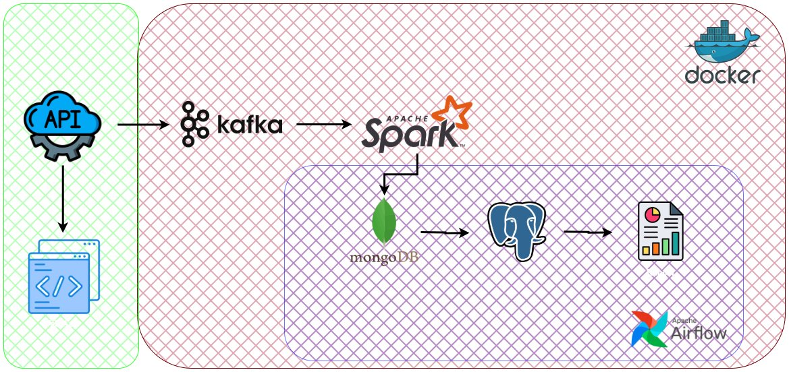

# Real-Time Flight Data Processing and Visualization

This project demonstrates a real-time data engineering pipeline that ingests, processes, and stores flight data. The pipeline is built using Apache Kafka, Apache Spark, MongoDB, and PostgreSQL, and orchestrated with Apache Airflow. The project also includes a web-based visualization of the real-time flight data.



## Features

*   **Real-time data ingestion:** A flight data simulator generates real-time flight information.
*   **Scalable data streaming:** Apache Kafka is used as a message broker to handle high-throughput data streams.
*   **Distributed data processing:** Apache Spark Structured Streaming processes and transforms the flight data in real-time.
*   **Flexible data storage:** The processed data is stored in MongoDB (for flexible, semi-structured data) and PostgreSQL (for structured data and reporting).
*   **Workflow orchestration:** Apache Airflow manages the data pipeline, scheduling and executing tasks in a defined order.
*   **Web-based visualization:** A simple web interface displays the real-time positions of the flights on a map.
*   **Containerized deployment:** The entire application is containerized using Docker and can be easily deployed with Docker Compose.

## Technologies Used

*   **Data Ingestion:** Flask, Python
*   **Data Streaming:** Apache Kafka
*   **Data Processing:** Apache Spark
*   **Databases:** MongoDB, PostgreSQL
*   **Orchestration:** Apache Airflow
*   **Frontend:** HTML, JavaScript
*   **Containerization:** Docker, Docker Compose

## Project Structure

```
.
├── create_table.sql                # SQL script to create the PostgreSQL table
├── dags
│   └── dag.py                      # Airflow DAG for the data pipeline
├── data                            # Data directory
├── flight-map-api                  # Flask API for flight data simulation and visualization
│   ├── app.py                      # Flask application
│   ├── index.html                  # HTML for the flight map
│   └── traffic.js                  # JavaScript for the flight map
├── kafka-spark-streaming-files     # Directory for Kafka and Spark files
├── notebooks                       # Jupyter notebooks for data exploration
├── outputs                         # Directory for output files (e.g., CSV reports)
├── plugins                         # Airflow plugins
│   ├── daily_report.py
│   └── insert_data_into_postgres.py
├── script
│   └── entrypoint.sh
├── spark-apps                      # Spark applications
│   ├── flight-consumer.py          # Spark consumer for processing data from Kafka
│   └── flight-producer.py          # Spark producer for sending data to Kafka
├── .env                            # Environment variables
├── docker-compose.yml              # Docker Compose file for deploying the application
├── Dockerfile                      # Dockerfile for the Airflow image
└── README.md                       # This file
```

## Getting Started

### Prerequisites

*   Docker
*   Docker Compose

### Installation and Running

1.  **Clone the repository:**

    ```bash
    git clone https://github.com/your-username/flight-map-kafka-spark-mongo-postgresql.git
    cd flight-map-kafka-spark-mongo-postgresql
    ```

2.  **Build and start the services:**

    ```bash
    docker-compose up --build
    ```

    This will start all the services defined in the `docker-compose.yml` file, including Kafka, Spark, Airflow, PostgreSQL, and MongoDB.

3.  **Create an Airflow user:**

    Open a new terminal and run the following command to create an Airflow user:

    ```bash
    docker-compose exec scheduler airflow users create \
        --username admin \
        --firstname <your-firstname> \
        --lastname <your-lastname> \
        --role Admin \
        --email <your-email>
    ```
    You will be prompted to enter a password for the user.

4.  **Run the producer and consumer:**

    Open another terminal and run the following commands to start the Spark producer and consumer.

    *   **Run the producer:**
        ```bash
        docker-compose exec spark-master spark-submit --master spark://spark-master:7077 --packages org.apache.spark:spark-sql-kafka-0-10_2.12:3.1.1 /spark/apps/flight-producer.py
        ```

    *   **Run the consumer:**
        ```bash
        docker-compose exec spark-master spark-submit --master spark://spark-master:7077 --packages org.apache.spark:spark-sql-kafka-0-10_2.12:3.1.1,org.mongodb.spark:mongo-spark-connector_2.12:3.0.1 /spark/apps/flight-consumer.py
        ```

## Data Pipeline

The data pipeline consists of the following steps:

1.  **Data Generation:** The Flask application (`flight-map-api/app.py`) simulates real-time flight data. You can access the API at `http://localhost:5000/api/flights`.

2.  **Data Production:** The Spark application `spark-apps/flight-producer.py` fetches data from the Flask API and sends it to the `flight-producer` Kafka topic.

3.  **Data Consumption and Processing:** The Spark Streaming application `spark-apps/flight-consumer.py` consumes data from the Kafka topic, processes it, and stores it in a MongoDB collection.

4.  **Data Orchestration:** The Airflow DAG `dags/dag.py` orchestrates the final steps of the pipeline:
    *   It fetches the processed data from MongoDB.
    *   It inserts the data into the `flights` table in PostgreSQL.
    *   It generates a daily report from the PostgreSQL data and saves it as CSV files in the `outputs` directory.

## How to Use

*   **Airflow UI:** Access the Airflow web interface at `http://localhost:8080`. You can monitor and manage the `flights_dag` from here.
*   **Flight Map:** Open `flight-map-api/index.html` in your web browser to see the real-time flight visualization.
*   **pgAdmin:** Access the pgAdmin interface at `http://localhost:5050` to query the PostgreSQL database. Use `admin@admin.com` as the email and `admin` as the password.
*   **Jupyter Notebook:** Access the Jupyter Notebook server at `http://localhost:8888`. You can use the notebooks in the `notebooks` directory to explore the data.
    *   **Note:** To install additional libraries in Jupyter, open a terminal in the Jupyter interface and use `pip install <library-name>`.
*   **Confluent Control Center:** Access the Confluent Control Center at `http://localhost:9021` to monitor the Kafka cluster.

## Output

The project generates the following outputs:

*   **Real-time data in MongoDB:** The `flight-consumer` Spark application writes the processed flight data to a MongoDB collection.
*   **Structured data in PostgreSQL:** The Airflow DAG inserts the flight data into the `flights` table in PostgreSQL.
*   **CSV Reports:** The Airflow DAG generates daily reports in CSV format and saves them in the `outputs` directory. The reports include:
    *   `delayed_status_distribution.csv`
    *   `top_10_late_ratio_airlines.csv`
    *   `top_5_airlines.csv`

